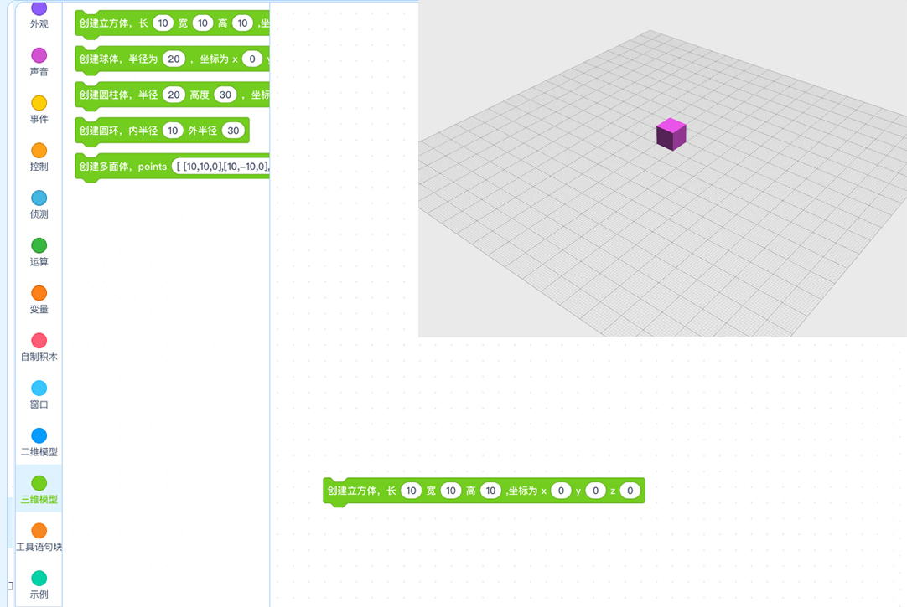

# BlockCAD for mblock5

This extension is developed by [mblock5 extension designer](http://ext.mblock.cc). You can visit [http://ext.makeblock.com](http://ext.makeblock.com) to speedup the network speed if you are in China.


It enables you make 3D primitives and 2D primitives just by draging blocks. And the model you make can be downloaded as many kinds of formats, such as `.stl`, `AMF`, `DXF` etc.



The extension is based on [https://openjscad.org](https://openjscad.org).

## Install
Todo

## Usage
The base script format is

```js
function main () {
  return cube({size: [10,10,10]})
}
```

You can find more here [https://openjscad.org/dokuwiki/doku.php?id=design_guide_cube](https://openjscad.org/dokuwiki/doku.php?id=design_guide_cube)

## Example
Todo

## ChangeLog

### v0.1.1
- Todo
    - add `Union`, `Intersection`, `difference`, `Hull` function

### v0.1.0
- add basic blocks to render 3D primitives and 2D primitives.


